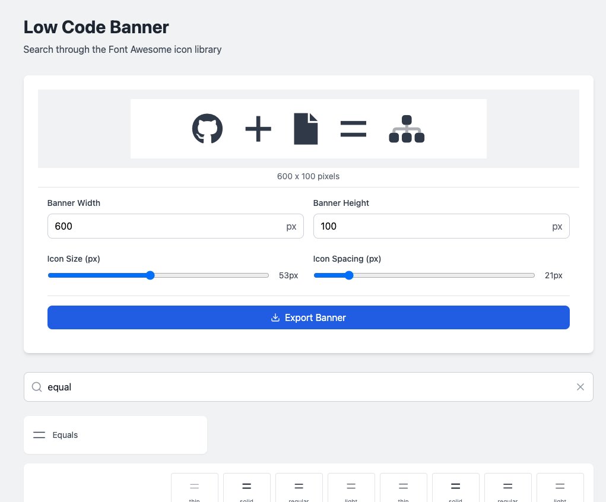
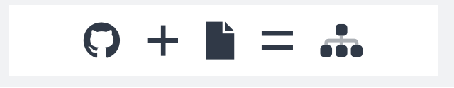

# "Februrary No Code Challenge"
This is part of my no-code-feb, where I try to build applications
of increasing complexity to find the outter limit of what AI can do
to replace my code-first inner developer.

- __When__: Week 2 Feb 2025
- __Timelimit__: 30m, actual time 21m.
- __Tokens__: 210k
- __Ai Builder__: [Bolt.new](https://bolt.new)
- __Quality__: Good for Internal use. Not production ready.
- __Demo__: [Demo Site](https://apps.banner.lowcodecto.com/)
- __Mission__: Build on Bolt.new, tweak in code on Github.

# Goal
The goal of this app is help me build and change the portrait
banner for newsletter articles to speed up the content generation
process. Next up I want to try wiring in an API function so that
an AI agent can generate 3 or 4 options for a new article as
a part of my content generation process.

- One page application.
- Built in React.js
- Uses an Algolia Index for Icon names.
- Builts a 1x3+ banner using icons as iconograph.
- Allows the user to search and brower all the icons in the library.
- Allows the user to change the icon width, spacing, color.
- Exports to a PNG file.
- Local storage for the icons defaults and settings.
- Uses Redux for state management.
- Uses Netlify for hosting.

Screenshot of the banner builder.

Here is an example of how I use the banner builder to
create a banner for each newsletter article. I did not like
the Beehiiv AI logo builder. Felt to non-human.

Example of the file it creates.

## Pain Points
- Spacing between icons changes in prompt requests.
- Icon offset needed code to make it align.
- Use of modal needed more prompts then expected.

## Subscribe to learn more...
I am a fractional CTO, and recovering startup founder. I use
No-Code and Low-Code tools and patterns to built revenue generating
applications, without the need to code.

[Subscribe to my newsletter](https://lowCodeCTO.com)

## Local Development
Reminder commands for myself for local tweaks.

- `npm run dev`
- `npm run build`
- `netlify deploy` or `netlify deploy --prod`
